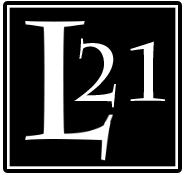

| Racourcis                       |                                     |
| ------------------------------- | ----------------------------------- |
| Feuille de score                | https://edhleague.be/score.pdf      |
| Inscriptions (Du 07 au 25 juin) | https://forms.gle/UnWomAb4zPNAx5Vu6 |
| Scores                          | TBD                                 |

# Ligue été 2021

[TOC]

## **Présentation** 

L'esprit de cette ligue est similaire à la première : permettre aux gens de  jouer dans un cadre amicalement compétitif et repartir avec un chouette prizing quel que soit la position dans le classement tout en gardant les frais  d’entrée suffisamment bas pour ne pas décourager les joueurs avec moins  de temps. 

La ligue était initialelment à but privé, l'ouverture des commerce se mettant en marche, elle prends une tournure plus publique, des changements ont, et continueront, d'avoir lieu d'ici le début de la ligue pour prendre en compte cette différence "de dernière minute". 

| Contact | Discord       |                           |
| ------- | ------------- | ------------------------- |
| Manu    | Manu404#6726  | contact@emmanuelistace.be |
| Greg    | Yberamos#2213 | gregoiredemoulin2@gmail.com |
| Joffrey (Autre monde)    | TBD | TBD |