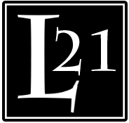

[comment]: # (This file is generated, don't modify it, check content subfolder)

[comment]: # (Ce fichier est généré, ne le modifiez pas, regarder le sous dossier content)
# Ligue été 2021

[TOC]

## **Présentation** 

L'esprit de cette ligue est similaire à la première : permettre aux gens de  jouer dans un cadre amicalement compétitif et repartir avec un chouette prizing quel que soit la position dans le classement tout en gardant les frais  d’entré suffisamment bas pour ne pas décourager les joueurs avec moins  de temps. 

| Contact | Discord       |            |                           |
| ------- | ------------- | ---------- | ------------------------- |
| Manu    | Manu404#6726  | 0498236279 | contact@emmanuelistace.be |
| Greg    | Yberamos#2213 | 0471292851 | gregoiredemoulin2@gmail.com |

## Organisation 

### Inscription 

Inscriptions du lundi 07 juin au vendredi 25 juin via formulaire google form.  

Les frais d’inscriptions sont de 5€ et sont à verser sur le compte <compte> ou à remettre en main propre au TO (greg ou manu).   

Un participant peut aussi payer son inscription en fournissant des cartes du prizing, a condition que ce soit avant la fin des inscriptions et avant la commande du prizing, ce sera très apprécié et remercié, à voir avec un TO. 

Le paiement confirme l’inscription. L’inscription permet de payer le prizing. Il y a 12 places disponibles (pour le moment). 

La ligue débute le vendredi 02 juillet et se termine le vendredi 30 juillet. 

### Jours de rencontre et réservation 

Les rencontres ont lieu chez Greg les <jour 1> et <jour 2> de chaque semaine sur réservation. Les réservations se font jusqu’au jour précédent à 20:00 afin d’éviter d’avoir trop ou trop peu de monde et permettre de s’organiser. La limite est fixée à 8 joueurs par jours de rencontre.  

### Invités 

Il est possible pour un joueur non inscrit à la ligue de participer, sur acceptation préalable d’un TO. Dans ce cas, 2€ seront demandé au participant en échange de la possibilité de jouer, il pourra aussi choisir une boisson et un snack (cfr “Organisation - L’échoppe de Karadoc”). Cfr. “Règlement - Points”. 

### Accès aux résultats 

Les résultats sont disponibles en ligne via: <url score> 

Les résultats seront mis en ligne au fur et à mesure le plus rapidement possible, compter un ou deux jours. 

### Prizing 

Chaque joueur pourra, par ordre de classement, prendre une carte dans le prizing disponible. Le prizing présenté plus loin est trié par ordre de prix à titre indicatif. Aussi, des tokens, liés au classement, seront remis au top3. Le vainqueur se verra également remettre un trophée porte-carte (identique à celui remis lors de la précédente ligue). Le prizing sera remis début aout aux joueurs par ordre de classement. 

### Materiel 

Une boite, contenant des portes-mines/crayons/gommes pour remplir les feuilles de score et des rappels imprimé et plastifié des règles ainsi que des points, seront mit à disposition. Prenez soin du matériel et veillez à le laisser dans la salle de jeu. À la fin de la journée, n’hésitez pas à ramener le matériel dans la boite prevue a cet effet. 

### Pot commun 

Un pot commun est mis en place et sera utilisé pour le prizing de la ligue suivante OU utilisé à la fin de cette ligue si une majorité des joueurs le souhaitent.  

Le solde ainsi que l’historique sont accessible via la page de résultat. 

Les joueurs ont la possibilité de payer 2€ de participation à un TO (liquide, virement ou mobile) ce qui donnera droit à une boisson et un snack. Ce n’est pas imposé, il reste possible de simplement les acheter pour 1.5€, ou ne rien payer/consommer. Les bénéfices vont tous dans le pot commun.  

Selon les retours et le déroulement, ce système sera adapté ou abandonné pour la prochaine ligue.  

Par exemple si chaque joueur met 2€ quand il vient, en plus de son snack et boisson, en comptant “que” 4 joueurs présent par jours de rencontre: 4 semaines * 2 jours * 4 joueurs * (2€ - (prix coutant)) = 32€, mis dans le pot commun, soit plus de la moitié des fonds disponible de cette édition. 

### L'échoppe de Karadoc 

Des boissons et à grignoter sont proposé à prix libre en test, les prix d’achats et un prix conseillé sont indiqué. Les bénéfices vont intégralement dans le pot commun. Le paiement peut se faire auprès d’un TO en liquide, via le compte qui a servi à l’inscription ou via application mobile. Les ardoises sont autorisées, en évitant les abus, et devront être soldé pour la fin de la ligue.  Les “stocks” seront assuré et mis à jours selon la consommation et envies des participants. Les joueurs restent libre de prendre leurs boissons et snacks.  

Par exemple, si chaque joueur prend un soft et un snack/présence (1.5€, 0.5€ vont dans le pot commun) et qu’il n’y a chaque fois que 4 joueur de présents, 4 semaines * 2 jours * 4 joueurs = 16€ reporté sur la ligue suivante et des joueurs rafraichi et temporairement repu.  

|                                                              | **Prix d’achat**   **Delhaize / Colruyt** | **Prix conseillé** |
| ------------------------------------------------------------ | ---------------------------------------------- | ------------------ |
| Coca 33cl                                                    | 0.70 / 0.62                                    | 1                  |
| Fanta 33cl                                                   | 0.70 / 0.67                                    | 1                  |
| Ice TEA 33CL                                                 | 0.76 / 0.65                                    | 1                  |
| Jupiler 25cl                                                 | 0.53 / 0.43                                    | 1                  |
| Red bull 25CL                                                | 1.14 / 1                                       | 2                  |
| Monster 50CL                                                 | 1.39 / 1.30                                    | 2                  |
| Bouteille d’eau 50cl                                         | 0.13 / 0.13                                    | 0.5                |
|                                                              |                                                |                    |
| Pomme                                                        | 0.36                                           | 0.5                |
| Raisins blanc (250gr, demi ravier)                           | 0.85                                           | 1                  |
| Banane                                                       | 0.16                                           | 0.5                |
|                                                              |                                                |                    |
| Petit Chips (Sel, paprika, ketchup, grills, buggles, cheetos) | 0.23 / 0.23                                    | 0.5                |
| Mini sachet bonbons (assortiment)                            | 0.21 / 0.15                                    | 0.5                |
| Twixx / Mars / SNICKERS                                      | 0.31 / 0.25                                    | 0.5                |
| Kinder Maxi                                                  | 0.25 / 0.24                                    | 0.5                |
| Gauffre de liège                                             | 0.26 / 0.10                                    | 0.5                |
| Chuppa-shups (1 mix + 1 best)                                | 0.18 / 0.15 - 0.10                             | 0.5                |
| Mentos fruit                                                 | / 0.30                                         | 0.5                |
|                                                              |                                                |                    |
| GL HF  1 snack au choix par joueur à table, uniquement durant une partie | +/- 1                                          | 1.5                |
| POT de VIN   assortiment haribo 100gr, uniquement durant une partie | 2.35                                           | 3.5                |
| Offre généreuse  20 mini snickers, twix, bounty, mars, mily way, uniquement durant une partie | / 2.89                                         | 4                  |
| Tournée de la victoire   4 soft ou bières et 4 snacks ou fruits, ne peut s’acheter qu'a la fin d’une partie | +/- 3.5                                        | 5                  |

## Règlement 

### Déroulement d’un match. 

Pour lancer un match, les joueurs doivent s’être mis d’accord sur le mode de jeu, ensuite une feuille de score pourra être demandé au TO et remplie par les joueurs. Quand les joueurs sont prêts, le TO lance le match en même temps que le timer, le temps est surveillé par le TO. Quand le match est fini, la feuille devra être vérifié et signée par tous les joueurs de la table et rendue au TO. 

### Modes de jeu : Casual et CEDH 

Il est possible de jouer en mode casual ou CEDH. L’ensemble des joueurs de la table doit se mettre d’accord sur le mode de jeu avant de débuter la partie. Le mode de jeu devra être indiqué sur la feuille de score. 

En mode CEDH, uniquement les points « Traditionnel » sont actifs, il n’y a pas de pénalités et il n’est pas possible d’acheter ni du temps, ni des actions, les régles du jour (ROTD) ne sont pas active. London mulligan avec un mulli gratuit, draw au premier tour. 

Le mode casual récompense le jeu plus que la victoire et comporte donc toutes les règles de points. Les parties peuvent durer plus de 2h (cf. Temps). Dans ce mode, il peut être intéressant de s’accorder sur un powerlevel “équilibré” entre les joueurs. Le London mulligan est d'application, toutefois avec deux mulligan gratuit au lieu d'un seul, draw au premier tour. 

Le mode de jeu influe sur les règles de points active ou non, rien n’empêche d’utiliser des decks CEDH en partie casual si la table le souhaite ou d’utiliser des decks “casual” en mode CEDH. Mais les joueurs CEDH souhaiteront certainement pouvoir jouer plus “librement”. 

|                            | **CASUAL** | **CEDH** |
| -------------------------- | ---------- | -------- |
| *Points Traditionnel*      | X          | X        |
| *Pénalités*                | X          | -        |
| *Bonus & ROTD*             | X          | -        |
| *Achat de temps & actions* | X          | -        |
| *Don de points*            | X          | X        |
| *Mulligan*                 | London     | London   |
| *Mulligan gratuit*         | 2          | 1        |

### Points 

Certaines actions durant le match rapportent ou font perdre des points. Ces points sont cumulables par joueur et par match, il est possible que le même joueur marque plusieurs fois le même point durant le même match. La seule exception à cette règle sont les points du jours qui ne peuvent être obtenu qu’une fois par match par joueur. 

Si un invité a pris part au match, à la fin de celui-ci, chaque adversaire de ce joueur gagne un nombre de point egal aux points de ce joueur divisé par le nombre de ses adversaires arrondi a l’inférieur. 

Par exemple, un invité gagne 5 points et à terminé un match contre 3 autres joueurs, chaque joueur gagne 1 point 

### Régles du jour - Rules of the day (ROTD) 

Au début de chaque journée de rencontre, 3 règles de la liste ROTD sont tirées au sort par le TO, ou les joueurs présent, à l’aide d’un D20. Si un nombre est déjà sorti ce jour-là, le dès est relancé. Ces points ne peuvent être obtenus qu’une fois par joueur et par match casual. Les ROTD ne sont pas actives en cEDH. Les ROTD seront rappelés par le TO au lancement du match et indiqué sur la feuille de score.  

### Don de points 

Durant une partie, les joueurs peuvent donner des points à d’autres joueurs, par exemple en échange de certaines actions. Le nombre total de points pouvant être donné durant une partie est limité à 5 et ils doivent être disponible au début de la journée de rencontre. Un don est point est traité comme une action spéciale. Pour utiliser cette action, vous devez appeler un TO présent. Ces dons sont possible en CEDH et en casual. 

### Babioles 

Des objets, appelé babioles, sont disponibles à l’achat auprès d’un TO et peuvent être acquis entre les parties en dépensant vos points. Le cout en point doit être disponible dans le solde du joueur au début de la journée de rencontre. Lors de l‘achat le token représentant la babiole vous sera donné. 

Les babioles sont représentées par des emblèmes et peuvent être mise en jeu, dans la zone de commandement, avant d’avoir pioché sa première main. Chaque joueur doit annoncer qu'il a mis une babiole en jeu. Elles ne peuvent pas être mise en jeu en CEDH. Quand la babiole est utilisée, elle cesse d'exister, elle n’est ni détruite, ni exilée (ne trigger rien et ne va nulle par). Utiliser une babiole est une action spéciale et ne passe donc pas par la stack. Son usage doit être reporté sur la feuille de score. 

| **Cout** | **Effet**                                            | **Nom de l’objet** | **Cible**     | Spoiler order |
| -------- | ---------------------------------------------------- | ------------------ | ------------- | ------------- |
| **2**    | Gagnez 5 pv                                          | Fiole de vie       | You           | 0             |
| **4**    | Exilez la créature ciblée                            | Bâton du vide      | Target crea.  | 2             |
| **3**    | Mulligan gratuit, avec remise (si 6 cartes ou moins) | Fleurs séchés      | You           | 1             |
| **4**    | Mulligan à 7, avec remise 1                          | Racine étrange     | You           | 7             |
| **2**    | Scry 1                                               | Monocle des pensés | You           | 0             |
| **4**    | Draw 1                                               | Tome de préscience | You           | 4             |
| **3**    | Fog                                                  | Potion d’oubli     | Target player | 3             |
| **7**    | Teferi’s Protection jusqu’à la prochaine upkeep      | Faveur des dieux   | Target player | 8             |
| **5**    | Disallow                                             | TBD                | Target spell  | 5             |
| **10**   | ???                                                  | ???                | ???           | 6             |

### Feuille de score 

Une feuille de score par match sera obtenue auprès d’un TO. La table devra remplir le nom des joueurs et le mode de jeu choisit avant de débuter la partie. À la fin de la partie chaque joueur devra signer ou parapher la feuille avant de la rendre. Gardez la propre, clair et lisible. La table est responsable de tenir la feuille à jour durant la partie. Quand un point est marqué un trait doit être indiqué à l’intersection de la ligne et colonne correspondante. Les ligne grisée concernent des points qui peuvent être vérifié en fin de partie. Les 3 lignes du fond concernent les points du jours (cf. Points du jour) N’écrivez qu’au crayon ou encre effaçable pour conserver les feuilles lisibles. (portes mine fourni) 

### Temps 

La limite de temps est de 2H par match. Le temps est surveillé par le TO qui a lancé la table.  

Dans le cas d’une partie casual, si la limite de temps est atteinte, il est possible d’étendre le match en achetant une extension temps de de 30minutes auprès TO. L'ensemble des joueurs de la table doivent être d'accord. Le cout de l’extension est egal au nombre de joueur toujours a table multiplié par 1 + le nombre d’extension de temps précédemment acheté durant la partie (“cumulative cost”). Plusieurs joueurs peuvent aider à payer le cout. Si l’extension est achetée, elle est noté sur la feuille de score et le timer est relancé par le TO. Dans le cas où une extension de temps n’est pas achetée ou que le TO la refuse (pour respecter de possibles contraintes de temps), chaque joueur non éliminé reçoit un point et le match est déclaré draw. 

Par exemple, il reste 3 joueurs a table et ils veulent acheter une troisième extension de 30 minutes, le cout en points est égal à 3 * (1 + 2) = 9

Dans le cas d’une partie CEDH, aucune extension de temps ne peut être achetée et les joueurs ne reçoivent pas de points supplémentaires en cas de draw.

## **Points** 

### Traditionnel (casual & CEDH) 

|        | **Nom**               | **Description**                                              |
| ------ | --------------------- | ------------------------------------------------------------ |
| **+2** | Dernier debout        | Gagner la partie                                             |
| **+1** | Tu sors!              | Eliminer un joueur                                           |
| **+1** | A la table des grands | Jouer dans une partie CEDH                                   |
| **+1** | On ferme!             | Etre éliminé au time en partie casual ou être contraint par le TO d'arrêter la partie |

### Pénalités (casual) 

|        | **Nom**                    | **Description**                                              |
| ------ | -------------------------- | ------------------------------------------------------------ |
| **-2** | Lâche                      | Abandonner durant le tour d’un adversaire ou a des fins stratégiques |
| **-1** | Je veux voir votre manager | Gagner sans avoir joué son commandant                       |
| **-4** | Buzz                       | Gagner avant le 6éme tour d’un joueur                        |
| **-2** | On continue à 3?           | Gagner la partie et qu’aucuns joueur n’ai perdu de points de vie |
| **-2** | Infanticide                | Eliminer un adversaire avant son 6éme tour                           |
| **-1** | Cancer toxique             | Eliminer plus d’un adversaire avec des marqueurs poisons     |
| **-2** | Gouffre                    | Détruire/lock la moitié des lands d’un joueur ou une couleur |
| **-3** | Pas les lands              | Détruire plus de deux lands d’un même joueur autre que soit  |
| **-2** | Solitaire                  | Chercher dans son deck 3 fois dans le même tour |
| **-2** | Greedy McGreederson        | Jouer 3 tours d’affilé                                       |
| **-1** | Rien de neuf?              | Jouer le même sort 3 fois durant le même tour                |
| **-1** | Du calme!                  | Jouer plus de deux sorts durant son premier tour             |
| **-1** | Ma main !?                 | Faire qu’un joueur se défausse de sa main (plus de 2 cartes) |
| **-2** | Je veux jouer aussi!       | Controller le même joueur deux tour d’affilé                 |

### Bonus (casual) 

|        | **Nom**             | **Description**                                              |
| ------ | ------------------- | ------------------------------------------------------------ |
| **+1** | Touché              | Etre le premier de la partie a faire un dégât a un joueur    |
| **+1** | Je gère             | Eliminer un adversaire durant le tour d'un autre adversaire  |
| **+2** | Nope                | Empêcher ou retarder un combo qui met fin ou lock le match   |
| **+2** | Cruel mais efficace | Eliminer un adversaire autrement qu’en réduisant sa vie à 0  |
| **+1** | Généralissime       | Eliminer un adversaire aux dégâts commandeurs |
| **+1** | Sang frais          | Eliminer un adversaire avec une carte éditée pour la première fois à partir de strixhaven. |
| **+1** | Tiens bon!          | Empêcher un joueur de mourir                                 |
| **+1** | Cafard              | Survivre à un tour ou plusieurs joueurs sont mort, sans être responsable de leur mort. |
| **+3** | Guerrier Koh-Lanta  | Survivre 3 tours avec un seul point de vie restant           |
| **+2** | Diversifié          | Contrôler une créature, une créature légendaire, un artefact, un enchantement, un basic land, un land non basique, un planeswalker, avoir un sorcery et un instant sur la stack. |
| **+2** | Autophobie          | Invoquer votre commandant 5 fois depuis la zone de commandement. |

###  Bonus de fin de match(casual) 

Peuvent être vérifié à la fin de la partie. 

|        | **Nom**                  | **Description**                                              |
| ------ | ------------------------ | ------------------------------------------------------------ |
| **+1** | Belle magie!             | À la fin de la game, les joueurs peuvent nommer un play, les joueurs peuvent ensuite voter pour un play nome et celui avec le plus de vote accorde un point à son auteur. |
| **+1** | Tu es mon Héro!          | À la fin de la game, les joueurs votent chacun, secrètement, pour un autre joueur. Le joueur avec le plus de vote remporte un point. |
| **+1** | Les pv c’est la vie      | Gagner la game avec 80 points de vie ou plus.                |
| **+1** | Même pas mal             | Gagner la game avec moins de 5 points de vie                 |
| **+1** | Préfabriqué              | Jouer avec un deck préconstruit non modifié                  |
| **+1** | Elder Dragon Social Club | Jouer avec un deck préconstruit non modifié, et vos adversaires utilisent aussi tous un préconstruit non modifié. |
| **+1** | Futé                     | Jouer avec un deck ne contenant aucunes rares hors commandant. (rareté la plus basse si plusieurs prints) |
| **+1** | Argh, mes yeux !!!       | Jouer avec un deck entièrement foil                          |

 

### Règles du jour – Rule of the day - ROTD (casual) 

Cfr règlement règles du jours, +1 points chacun (sauf jour de colère et jour de chance), 3 actifs/jour 

| **D20** | **Nom**              | **Description**                                              |
| ------- | -------------------- | ------------------------------------------------------------ |
| **1**   | Jour de colère       | À la fin de la partie, chaque joueur, par ordre de priorité, a le choix de faire perdre un point a un autre joueur |
| **2**   | Nomade               | Finir la partie ou être éliminé avec le moins de land        |
| **3**   | Coulé                | Etre le premier joueur à infliger plus de 5 degats en une phase de combat |
| **4**   | La force de l’esprit | Exiler une créature avec une force supérieur a 11            |
| **5**   | Loup solitaire       | Finir la partie ou être éliminé en ayant invoqué que son commandant comme créature. |
| **6**   | Kamikaze             | Eliminer tous les joueurs en un tour, soit y compris.        |
| **7**   | Enchanté             | Controller 5 enchantements avec des noms différents          |
| **8**   | Dernière faveur      | Retirer le dernier marqueur loyauté d’un PW en utilisant une de ses capacités |
| **9**   | Pile-poil            | Tuer un joueur en le descendant exactement à 0 points de vie |
| **10**  | Hyper-actif          | Controller 3 instants sur la stack en même temps.            |
| **11**  | Arroseur-arrosé      | Résoudre un effet (sort ou capacité) qui a été ciblé par un contre controllé par un adversaire. |
| **12**  | Manipulateur         | Forcer un joueur à sacrifier une créature indestructible     |
| **13**  | Necronomicon         | Jouer un sort depuis le cimetière d’un adversaire            |
| **14**  | La famille           | Infliger des dégâts avec un commandant autre que le sien     |
| **15**  | Confession de foi    | Terminer la partie en n’ayant tutor/fetch que pour des basic lands |
| **16**  | Belle bête           | Controller une créature avec une force et endurance de 30 ou plus |
| **17**  | Dolorisme            | Recevoir 10 dégâts provenant de sources contrôlé par soit    |
| **18**  | Drogono              | Terminer la partie en ayant joué moins de 5 sorts passé le tour 6 |
| **19**  | Indiana Jones        | Contrôler plus de 8 artefacts                                |
| **20**  | Jour de chance       | À la fin de la partie, chaque joueur, par ordre de priorité, a le choix de faire gagner un point a un autre joueur. |